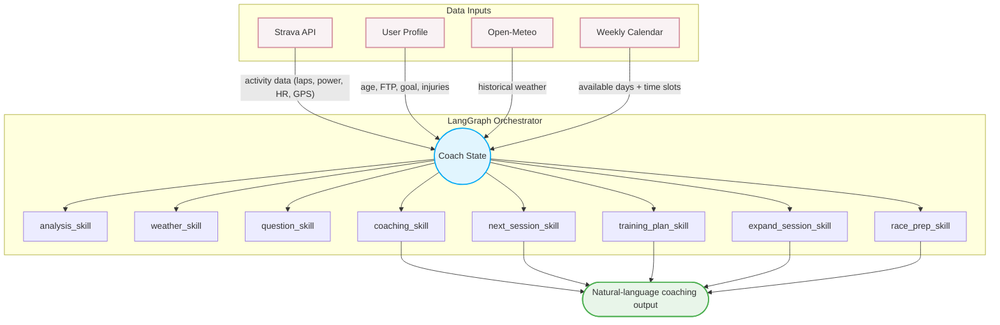
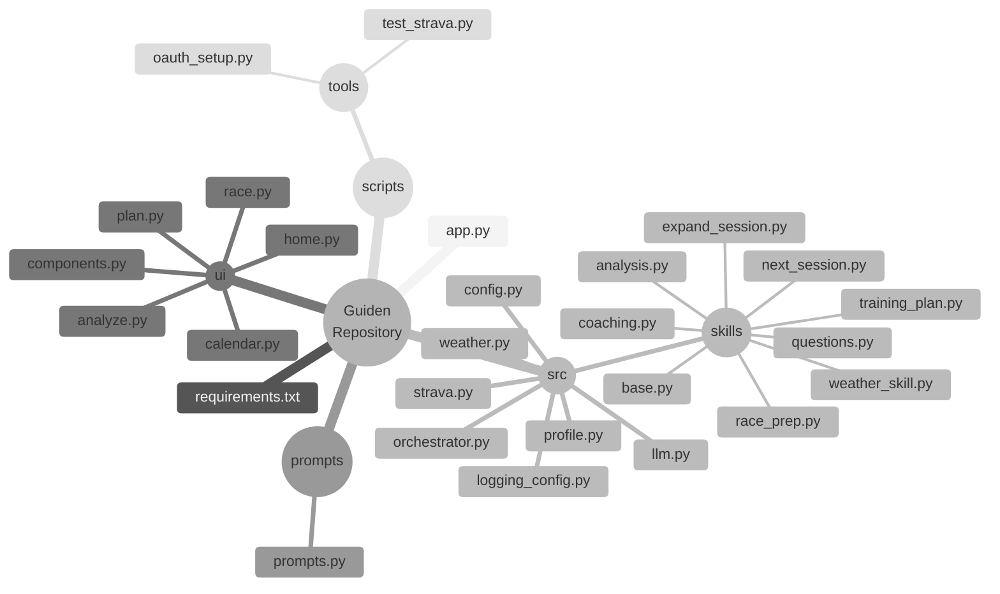
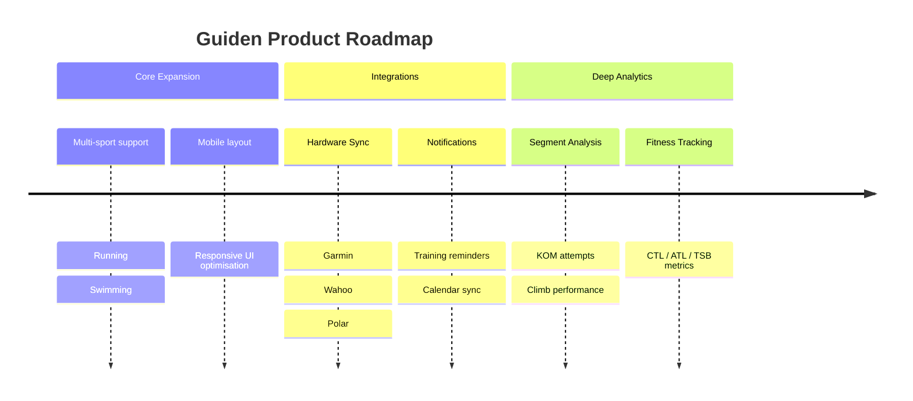

# 🚴 Guiden

**Your data-driven personal cycling coach — powered by Strava & OpenAI**

---

## The Problem
Most people train without a personal coach - no one to study their data, track their progress, or adjust their training plan. Whether your goal is to lose weight, run your first marathon, boost your cycling power, shave seconds off your swim splits, or simply feel stronger with every session, the right guidance makes all the difference. Most AI sports tools offer nothing more than a snapshot of a single workout, stripped of any real context. We offer something fundamentally different: an online platform powered by intelligent AI agents that analyze your runs, rides, and swims not as standalone events, but through the lens of your entire training history.

## The Solution
A multi-agent orchestration system built with LangGraph - **Guiden**. It moves beyond basic RAG by deploying specialized LLM skills (analysis, weather, inquiry, coaching) that maintain state, pause for human-in-the-loop feedback, and synthesize highly contextualized athletic guidance grounded entirely in verified Strava data.

---

## Features

| Feature | Description |
|---------|-------------|
| 🔍 **Analyze Workout** | Deep-dive into any Strava ride: power zones, weather impact, pacing, lap analysis, and a concrete next-step recommendation |
| 📅 **Training Plan** | Personalized multi-week plan with progressive overload, recovery weeks, and clickable day-level session detail |
| 🏁 **Race Prep** *(beta)* | Phased race preparation (Base → Build → Peak → Taper) with chat-based section expansion |
| 📅 **Training Calendar** | Set your weekly availability by day and time slot — the plan schedules around you |
| 🔢 **Token Tracking** | Live token/cost counter per session, configurable budget |

---

## Live Demo

> Local / self-hosted: `http://localhost:8501`  
> Streamlit Cloud: *coming soon*

---

## Tech Stack

- **Python 3.11+**
- `streamlit` — web UI
- `openai` / `langchain-openai` — LLM calls (gpt-4o-mini by default)
- `langgraph` — agent orchestration
- `requests` — Strava API & Open-Meteo weather API
- `pydantic` — data models
- `python-dotenv` — configuration

---

## Setup & Run

### Prerequisites
- Python 3.11+
- OpenAI API key
- Strava account + API app (free to create at [strava.com/settings/api](https://www.strava.com/settings/api))

### 1. Clone and create environment
```bash
git clone <repo-url>
cd guiden
python3 -m venv venv
source venv/bin/activate
pip install -r requirements.txt
```

### 2. Configure environment
```bash
cp .env.example .env
# Edit .env with your actual keys
```

### 3. Get your Strava credentials

1. Go to [strava.com/settings/api](https://www.strava.com/settings/api) and create an app
2. Note your **Client ID** and **Client Secret**
3. Run the OAuth helper to get a refresh token:
```bash
python3 scripts/tools/oauth_setup.py
```
4. Paste the printed `STRAVA_REFRESH_TOKEN` into your `.env`

> **Note:** Strava access tokens expire every 6 hours — the app automatically refreshes them using your `STRAVA_REFRESH_TOKEN` (which doesn't expire).

### 4. Run
```bash
streamlit run app.py
```

Open `http://localhost:8501` in your browser.

---

## Configuration

`All settings are read from `.env` with safe defaults:

| Variable | Default | Description |
|----------|---------|-------------|
| `OPENAI_API_KEY` | — | Required. Your OpenAI API key |
| `OPENAI_MODEL` | `gpt-4o-mini` | LLM model to use |
| `OPENAI_BASE_URL` | — | Custom/proxy endpoint (leave blank for OpenAI default) |
| `LLM_TEMPERATURE` | `0.4` | LLM creativity/randomness |
| `MAX_OUTPUT_TOKENS` | `1500` | Max tokens per LLM response |
| `SESSION_TOKEN_BUDGET` | `50000` | Max tokens per session before blocking |
| `COST_PER_M_INPUT` | `0.15` | Cost per 1M input tokens (USD) |
| `COST_PER_M_OUTPUT` | `0.60` | Cost per 1M output tokens (USD) |
| `STRAVA_CLIENT_ID` | — | Required. Your Strava app client ID |
| `STRAVA_CLIENT_SECRET` | — | Required. Your Strava app client secret |
| `STRAVA_REFRESH_TOKEN` | — | Required. Get via `scripts/tools/oauth_setup.py` |
| `TOP_K_ACTIVITIES` | `10` | How many recent activities to fetch by default |
| `DEFAULT_WEEKS_AHEAD` | `4` | Default training plan length in weeks |
| `LOG_LEVEL` | `INFO` | Logging verbosity (`DEBUG`, `INFO`, `WARNING`) |`

---

## Architecture



---

## Project Structure



---

## Roadmap


---

## Disclaimer

> ⚠️ This tool is AI-generated and for **informational purposes only**. It is **NOT medical advice**. Always consult a qualified coach or healthcare professional — especially if you have any health conditions — before making changes to your training.

